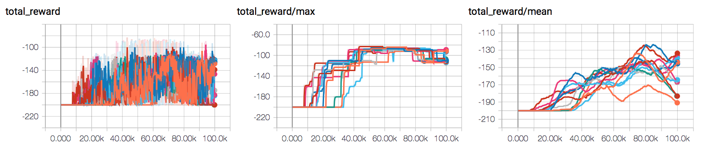

# DQN implementation

This is my implementation of DQN and variations in TensorFlow.

**[1]** Performance on MountainCar


### Done
- [x] convolution value function
- [x] MLP value function
- [x] double Q (or half Q really)
- [x] layernorm
- [x] grad norm clipping
- [x] prioritized replay (needed for mountain car)
    - [x] Prioritized replay buffer
    - [x] Segment Tree
    - [x] reweighing trick
- [x] investigate slow on-set of goal-trajectory: Just need to add `prioritized_replay_eps`
- [x] even with prioritized-replay turned on, learning regresses afterward. This is not the correct behavior: Fix is the same as above.

### Backlog

- [ ] write down the formula for the priority-replay.
- [ ] add param noise
- [ ] implement C51

## Highlights

Lessons and some mistakes made along the way:

##### On Training Speed
- The default `num_cpu` is 16. This is a good number. More threads run faster even though 16 is more than the number of hyper-threads of the hardware (8).
- Python `multiprocess` is actually very good for running multiple experiments in parallel. Command line tool `dave` is not needed, because you can just run loops in a training script. This is easier than switching to `dave` with the python running shortcut in pyCharm. However, you might be able to setup `dave` as an `ExternalTool` with a keyboard shortcut. Even in that case, jumping in-between (<kbd>⌘</kbd> + <kbd>i</kbd> and `$ dave --experiment "config.yaml"`)still feels rough.

##### On Implementing the model

- `layernorm` is not the same as `batchnorm`![^1]

    [^1]: a good refresher on the two could be found here: https://theneuralperspective.com/2016/10/27/gradient-topics/
- In the `mlp` policy, the output of the Q function shall **NOT** have the `relu` activation.
    - [ ] write up why
- the weights are the `td_error`, not the squared huber losses. As a result, the priority weight is `np.abs(td_error) + 1e-6`
    - [ ] Could play with different concave functions
- **What to do with `priority == 0` which gives a divide-by-zero warning?**

    sometimes the `td_error` would be zero. Might want to add an epsilon to boost it.

    We have the parameter `prioritized_replay_eps == 1e-6` exactly for this reason:[^2]
    ```python
    prioritized_replay_eps = 1e-6
    new_priority = np.abs(td_error) + prioritized_replay_eps
    ```
    [^2]: This is in the baselines implementation, I just missed it.
    
- The `t0` and `t1` were flipped originally
- the huber loss was used to weight instead of the absolute value of the `td_error`
- somehow the on-set of first goal event is always fairly late. ~Attribute this to added *epsilon-greedy* noise. This parameter noise should be off with `parameter_noise == False`~ Incorrect, the original implementation was correct.
- in comparison, the `baselines` implementation usually has the first goal-trajectory appear fairly early-on. Might want to investigate when have more time.
    - Turned out that future experiment with the prioritized replay `epsilon` fixed this problem.

## Supported Environments

There is script for the following environments
- [x] CartPole-v1
- [x] MountainCar-v0
- [ ] PongNoFrameskip-v4
- [x] BreakoutNoFrameskip-v4

## On Logger

> Like other google products, TensorBoard has significant usability issues. I'm planning on writing a better ML dashboard in the future.

This version of logger is integrated with `tensorboard` and at the same time prints the data in a tabular format to your `stdout`.
- can silence `stdout` per key (per `logger.log` call)
- can print with color: `logger.log(timestep, some_key=green(some_data))`
- can print with custom formatting: `logger.log(timestep, some_key=green(some_data, percent))` where `percent`
- uses the correct `unix` table characters (please stop using `|` and `+`. **Use `│`, `┼` instead**)

A typical print out of this logger look like the following:

```python
from logger import Logger
logger = Logger(log_directory=f"/mnt/bucket/deep_Q_learning/{datetime.now(%Y%m%d-%H%M%S.%f):}")

logger.log_params(G=vars(G), RUN=vars(RUN), Reporting=vars(Reporting))
```
outputs the following


And the data from multiple experiments can be views with tensorboard. 


```log
═════════════════════════════════════════════════════
              G               
───────────────────────────────┬─────────────────────
           env_name            │ MountainCar-v0      
             seed              │ None                
      stochastic_action        │ True                
         conv_params           │ None                
         value_params          │ (64,)               
        use_layer_norm         │ True                
         buffer_size           │ 50000               
      replay_batch_size        │ 32                  
      prioritized_replay       │ True                
            alpha              │ 0.6                 
          beta_start           │ 0.4                 
           beta_end            │ 1.0                 
    prioritized_replay_eps     │ 1e-06               
      grad_norm_clipping       │ 10                  
           double_q            │ True                
         use_dueling           │ False               
     exploration_fraction      │ 0.1                 
          final_eps            │ 0.1                 
         n_timesteps           │ 100000              
        learning_rate          │ 0.001               
            gamma              │ 1.0                 
        learning_start         │ 1000                
        learn_interval         │ 1                   
target_network_update_interval │ 500                 
═══════════════════════════════╧═════════════════════
             RUN              
───────────────────────────────┬─────────────────────
        log_directory          │ /mnt/slab/krypton/machine_learning/ge_dqn/2017-11-20/162048.353909-MountainCar-v0-prioritized_replay(True)
          checkpoint           │ checkpoint.cp       
           log_file            │ output.log          
═══════════════════════════════╧═════════════════════
          Reporting           
───────────────────────────────┬─────────────────────
     checkpoint_interval       │ 10000               
        reward_average         │ 100                 
        print_interval         │ 10                  
═══════════════════════════════╧═════════════════════
╒════════════════════╤════════════════════╕
│      timestep      │        1999        │
├────────────────────┼────────────────────┤
│      episode       │         10         │
├────────────────────┼────────────────────┤
│    total reward    │       -200.0       │
├────────────────────┼────────────────────┤
│ total reward/mean  │       -200.0       │
├────────────────────┼────────────────────┤
│  total reward/max  │       -200.0       │
├────────────────────┼────────────────────┤
│time spent exploring│       82.0%        │
├────────────────────┼────────────────────┤
│    replay beta     │        0.41        │
╘════════════════════╧════════════════════╛
```

```python
from logger import Logger

logger = Logger('/mnt/slab/krypton/unitest')
logger.log(0, some=Color(0.1, 'yellow'))
logger.log(1, some=Color(0.28571, 'yellow', lambda v: f"{v * 100:.5f}%"))
logger.log(2, some=Color(0.85, 'yellow', percent))
logger.log(3, {"some_var/smooth": 10}, some=Color(0.85, 'yellow', percent))
logger.log(4, some=Color(10, 'yellow'))
logger.log_histogram(4, td_error_weights=[0, 1, 2, 3, 4, 2, 3, 4, 5])
```

colored output: (where the values are yellow)
```log
╒════════════════════╤════════════════════╕
│        some        │        0.1         │
╘════════════════════╧════════════════════╛
╒════════════════════╤════════════════════╕
│        some        │     28.57100%      │
╘════════════════════╧════════════════════╛
╒════════════════════╤════════════════════╕
│        some        │       85.0%        │
╘════════════════════╧════════════════════╛
╒════════════════════╤════════════════════╕
│  some var/smooth   │         10         │
├────────────────────┼────────────────────┤
│        some        │       85.0%        │
╘════════════════════╧════════════════════╛
```


